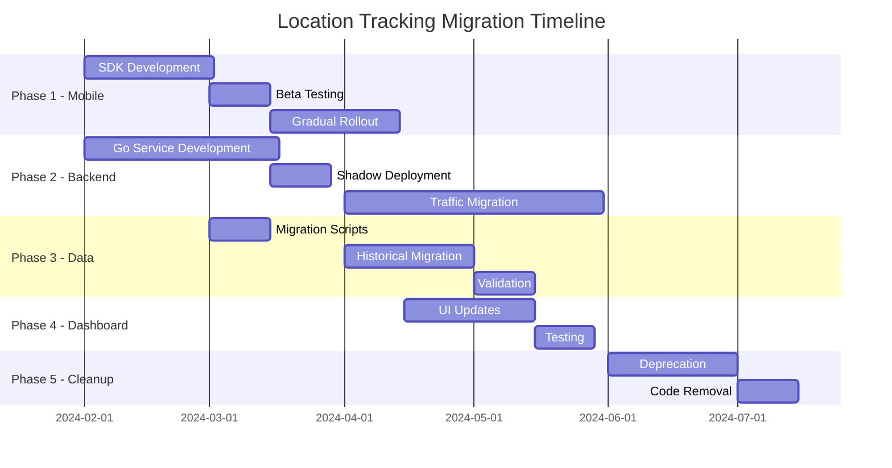

# Location Tracking Migration Strategy - TypeScript to Go Microservice

## Table of Contents
1. [Executive Summary](#1-executive-summary)
2. [Migration Overview](#2-migration-overview)
3. [Phase 1: Mobile App Migration (MQTT to Pub/Sub)](#3-phase-1-mobile-app-migration)
4. [Phase 2: Backend Migration (TypeScript to Go)](#4-phase-2-backend-migration)
5. [Phase 3: Data Migration](#5-phase-3-data-migration)
6. [Phase 4: Dashboard Integration](#6-phase-4-dashboard-integration)
7. [Phase 5: Deprecation & Cleanup](#7-phase-5-deprecation-cleanup)
8. [Risk Management](#8-risk-management)
9. [Timeline & Milestones](#9-timeline-milestones)
10. [Rollback Procedures](#10-rollback-procedures)

## 1. Executive Summary

### Migration Goals
- **Zero Downtime**: Seamless transition with no service interruption
- **Data Integrity**: 100% data preservation during migration
- **Performance**: Immediate 5x improvement, targeting 10x
- **Cost Efficiency**: 50% reduction in operational costs
- **Risk Mitigation**: Ability to rollback at any phase

### Key Strategies
1. **Parallel Running**: Both systems operate simultaneously
2. **Gradual Cutover**: Device-by-device migration
3. **Dual Publishing**: Mobile apps send to both MQTT and Pub/Sub
4. **API Compatibility**: Maintain existing endpoints during transition
5. **Comprehensive Testing**: Each phase thoroughly validated

## 2. Migration Overview

### Current State
```
Mobile Apps ──MQTT──▶ EMQX Broker ──▶ TypeScript Backend ──▶ MongoDB
                         │                      │
                         └──────────────────────┘
```

### Target State
```
Mobile Apps ──Pub/Sub──▶ Go Microservices ──▶ ClickHouse
     │                          │
     └──────HTTP/gRPC──────────┘
```

### Transition Architecture
```
                    ┌─────────────────┐
                    │  Mobile Apps    │
                    └────────┬────────┘
                      ┌──────┴──────┐
                      ▼             ▼
                ┌─────────┐   ┌─────────┐
                │  MQTT   │   │ Pub/Sub │
                └────┬────┘   └────┬────┘
                     ▼             ▼
            ┌──────────────┐ ┌──────────────┐
            │ TypeScript   │ │ Go Services  │
            │ Backend      │ │              │
            └──────┬───────┘ └──────┬───────┘
                   ▼                ▼
            ┌──────────┐     ┌──────────┐
            │ MongoDB  │     │ClickHouse│
            └──────────┘     └──────────┘
```

## 3. Phase 1: Mobile App Migration (MQTT to Pub/Sub)

### Overview
Transform mobile applications from MQTT-based location updates to Google Pub/Sub while maintaining backward compatibility.

### 3.1 Mobile SDK Changes

#### Current MQTT Implementation
```swift
// iOS - Current
class LocationTracker {
    private let mqtt: MQTTClient
    
    func sendLocation(_ location: CLLocation) {
        let payload = [
            "deviceId": deviceId,
            "latitude": location.coordinate.latitude,
            "longitude": location.coordinate.longitude,
            "speed": location.speed,
            "accuracy": location.horizontalAccuracy,
            "timestamp": location.timestamp
        ]
        
        mqtt.publish(topic: "device/telemetry/\(deviceId)", 
                    message: payload.toJSON())
    }
}
```

#### New Pub/Sub Implementation
```swift
// iOS - New
class LocationTracker {
    private let pubsub: PubSubClient
    private let mqtt: MQTTClient? // Optional for backward compatibility
    
    func sendLocation(_ location: CLLocation) {
        let payload = LocationUpdate(
            deviceId: deviceId,
            coordinates: Coordinates(
                latitude: location.coordinate.latitude,
                longitude: location.coordinate.longitude
            ),
            speed: location.speed,
            accuracy: location.horizontalAccuracy,
            timestamp: location.timestamp,
            batteryLevel: UIDevice.current.batteryLevel,
            networkType: getNetworkType()
        )
        
        // Primary: Send to Pub/Sub
        pubsub.publish(topic: "location-updates", 
                      message: payload) { error in
            if let error = error {
                // Fallback: Send to MQTT
                self.mqtt?.publish(topic: "device/telemetry/\(deviceId)", 
                                 message: payload.toJSON())
            }
        }
    }
}
```

### 3.2 Android Implementation
```kotlin
// Android - New
class LocationTracker(context: Context) {
    private val pubsub = PubSubClient(context)
    private val mqtt: MqttClient? = buildMqttClient() // Fallback
    
    fun sendLocation(location: Location) {
        val update = LocationUpdate(
            deviceId = getDeviceId(),
            coordinates = Coordinates(
                latitude = location.latitude,
                longitude = location.longitude
            ),
            speed = location.speed,
            accuracy = location.accuracy,
            timestamp = System.currentTimeMillis(),
            batteryLevel = getBatteryLevel(),
            networkType = getNetworkType()
        )
        
        // Try Pub/Sub first
        pubsub.publish("location-updates", update)
            .addOnFailureListener { exception ->
                // Fallback to MQTT
                mqtt?.publish("device/telemetry/$deviceId", 
                            update.toJson())
            }
    }
}
```

### 3.3 Feature Flags for Gradual Rollout
```json
{
  "location_tracking": {
    "use_pubsub": {
      "enabled": true,
      "rollout_percentage": 10,
      "device_whitelist": ["device-123", "device-456"],
      "fallback_to_mqtt": true
    }
  }
}
```

### 3.4 SDK Distribution Strategy
1. **Version 2.0.0-beta**: Dual publishing (MQTT + Pub/Sub)
2. **Version 2.1.0**: Pub/Sub primary, MQTT fallback
3. **Version 2.2.0**: Pub/Sub only, MQTT removed

## 4. Phase 2: Backend Migration (TypeScript to Go)

### 4.1 Service Deployment Strategy

#### Step 1: Deploy Go Services (Shadow Mode)
```yaml
# Kubernetes deployment
apiVersion: apps/v1
kind: Deployment
metadata:
  name: location-ingestion-go
  labels:
    app: location-tracking
    version: v2
    mode: shadow
spec:
  replicas: 3
  selector:
    matchLabels:
      app: location-ingestion-go
  template:
    spec:
      containers:
      - name: ingestion
        image: gcr.io/innovd/location-ingestion:v2.0.0
        env:
        - name: MODE
          value: "shadow"
        - name: FORWARD_TO_LEGACY
          value: "true"
```

#### Step 2: Traffic Splitting
```yaml
# Istio VirtualService for gradual migration
apiVersion: networking.istio.io/v1beta1
kind: VirtualService
metadata:
  name: location-api
spec:
  http:
  - match:
    - headers:
        x-use-v2:
          exact: "true"
    route:
    - destination:
        host: location-service-go
        port:
          number: 8080
  - route:
    - destination:
        host: location-service-typescript
        port:
          number: 3000
      weight: 90
    - destination:
        host: location-service-go
        port:
          number: 8080
      weight: 10
```

### 4.2 API Compatibility Layer

#### Compatibility Adapter
```go
// api/v1_compatibility.go
package api

import (
    "encoding/json"
    "net/http"
    "github.com/gorilla/mux"
)

// V1CompatibilityHandler wraps v2 handlers to maintain v1 API contracts
type V1CompatibilityHandler struct {
    v2Service *LocationServiceV2
}

// HandleV1LocationUpdate maintains backward compatibility
func (h *V1CompatibilityHandler) HandleV1LocationUpdate(w http.ResponseWriter, r *http.Request) {
    var v1Request V1LocationUpdate
    if err := json.NewDecoder(r.Body).Decode(&v1Request); err != nil {
        http.Error(w, err.Error(), http.StatusBadRequest)
        return
    }
    
    // Transform v1 to v2 format
    v2Request := &LocationUpdate{
        DeviceID: v1Request.DeviceID,
        Coordinates: Coordinates{
            Latitude:  v1Request.Latitude,
            Longitude: v1Request.Longitude,
        },
        Speed:       v1Request.Speed,
        Accuracy:    v1Request.Accuracy,
        Timestamp:   v1Request.Timestamp,
    }
    
    // Process with v2 service
    result, err := h.v2Service.ProcessLocation(r.Context(), v2Request)
    if err != nil {
        http.Error(w, err.Error(), http.StatusInternalServerError)
        return
    }
    
    // Transform response back to v1 format
    v1Response := map[string]interface{}{
        "status": "success",
        "data": map[string]interface{}{
            "locationId": result.LocationID,
            "processed": true,
        },
    }
    
    json.NewEncoder(w).Encode(v1Response)
}
```

### 4.3 Data Synchronization

#### Dual Write Strategy
```go
// Ensure data consistency during migration
type DualWriteService struct {
    mongoClient     *mongo.Client
    clickhouseConn  clickhouse.Conn
    migrationMode   bool
}

func (s *DualWriteService) SaveLocation(ctx context.Context, loc *Location) error {
    // Always write to new system
    if err := s.saveToClickHouse(ctx, loc); err != nil {
        return fmt.Errorf("clickhouse write failed: %w", err)
    }
    
    // Conditionally write to legacy system
    if s.migrationMode {
        if err := s.saveToMongoDB(ctx, loc); err != nil {
            // Log but don't fail - ClickHouse is source of truth
            log.Printf("MongoDB write failed: %v", err)
        }
    }
    
    return nil
}
```

## 5. Phase 3: Data Migration

### 5.1 Historical Data Migration

#### Migration Script
```go
// cmd/migrate/main.go
package main

import (
    "context"
    "time"
    "go.mongodb.org/mongo-driver/mongo"
    "github.com/ClickHouse/clickhouse-go/v2"
)

func migrateHistoricalData(ctx context.Context, from time.Time, to time.Time) error {
    // Connect to MongoDB
    mongoClient := connectMongoDB()
    defer mongoClient.Disconnect(ctx)
    
    // Connect to ClickHouse
    clickhouseConn := connectClickHouse()
    defer clickhouseConn.Close()
    
    // Batch processing
    batchSize := 10000
    offset := 0
    
    for {
        // Fetch batch from MongoDB
        locations, err := fetchLocationBatch(mongoClient, from, to, offset, batchSize)
        if err != nil {
            return err
        }
        
        if len(locations) == 0 {
            break
        }
        
        // Transform and insert into ClickHouse
        if err := insertBatchToClickHouse(clickhouseConn, locations); err != nil {
            return err
        }
        
        offset += batchSize
        
        // Progress logging
        log.Printf("Migrated %d records", offset)
    }
    
    return nil
}
```

### 5.2 Data Validation

#### Validation Process
```go
// Ensure data integrity post-migration
func validateMigration(ctx context.Context, date time.Time) (*ValidationReport, error) {
    mongoCount := getMongoDBCount(ctx, date)
    clickhouseCount := getClickHouseCount(ctx, date)
    
    // Sample data comparison
    mongoSample := getMongoDBSample(ctx, date, 1000)
    clickhouseSample := getClickHouseSample(ctx, date, 1000)
    
    discrepancies := compareDataSets(mongoSample, clickhouseSample)
    
    return &ValidationReport{
        Date:           date,
        MongoCount:     mongoCount,
        ClickHouseCount: clickhouseCount,
        MatchRate:      float64(clickhouseCount) / float64(mongoCount),
        Discrepancies:  discrepancies,
    }, nil
}
```

## 6. Phase 4: Dashboard Integration

### 6.1 API Client Updates

#### Current TypeScript Client
```typescript
// Current implementation
export class LocationAPI {
  async getLocationHistory(userId: string, date: string) {
    const response = await fetch(`/api/v1/location/history/${date}?userId=${userId}`);
    return response.json();
  }
}
```

#### New Dual-Mode Client
```typescript
// services/locationAPI.ts
export class LocationAPIV2 {
  private useV2 = featureFlags.get('use_location_v2');
  
  async getLocationHistory(userId: string, date: string) {
    if (this.useV2) {
      // Use new Go service
      const response = await fetch('/api/v2/locations/history', {
        method: 'POST',
        headers: {
          'Content-Type': 'application/json',
          'X-API-Version': 'v2'
        },
        body: JSON.stringify({ userId, date })
      });
      
      // Transform v2 response to match existing UI expectations
      const v2Data = await response.json();
      return this.transformV2ToV1(v2Data);
    } else {
      // Use legacy TypeScript service
      const response = await fetch(`/api/v1/location/history/${date}?userId=${userId}`);
      return response.json();
    }
  }
  
  private transformV2ToV1(v2Data: V2LocationHistory): V1LocationHistory {
    return {
      locations: v2Data.locations.map(loc => ({
        _id: loc.id,
        userId: loc.user_id,
        location: {
          type: 'Point',
          coordinates: [loc.coordinates.longitude, loc.coordinates.latitude]
        },
        speed: loc.speed,
        accuracy: loc.accuracy,
        timestamp: new Date(loc.timestamp)
      }))
    };
  }
}
```

### 6.2 Real-time Updates Migration

#### WebSocket Connection Manager
```typescript
// services/realtimeLocation.ts
export class RealtimeLocationService {
  private wsV1?: WebSocket;
  private wsV2?: WebSocket;
  
  connect(userId: string) {
    if (featureFlags.get('use_location_v2_realtime')) {
      // Connect to new Go WebSocket
      this.wsV2 = new WebSocket('wss://api.innovd.com/v2/locations/stream');
      
      this.wsV2.onopen = () => {
        this.wsV2.send(JSON.stringify({
          type: 'subscribe',
          filters: { user_ids: [userId] }
        }));
      };
      
      this.wsV2.onmessage = (event) => {
        const v2Update = JSON.parse(event.data);
        // Transform and emit
        this.emit('location', this.transformV2Update(v2Update));
      };
    } else {
      // Use legacy Socket.IO
      this.connectLegacySocket(userId);
    }
  }
}
```

## 7. Phase 5: Deprecation & Cleanup

### 7.1 TypeScript Service Deprecation Timeline

#### Month 1-2: Preparation
- Deploy Go services in shadow mode
- Set up monitoring and alerting
- Train team on Go codebase

#### Month 3-4: Gradual Migration
- 10% traffic to Go services
- Monitor performance and errors
- Fix any compatibility issues

#### Month 5: Increased Migration
- 50% traffic to Go services
- Deprecation notices in TypeScript code
- Update documentation

#### Month 6: Final Cutover
- 100% traffic to Go services
- TypeScript services in standby mode
- Final data validation

#### Month 7: Cleanup
- Remove TypeScript location tracking code
- Archive MongoDB collections
- Update all documentation

### 7.2 Code Removal Strategy

#### Step 1: Mark as Deprecated
```typescript
/**
 * @deprecated Use Go location service instead
 * @removal-date 2024-07-01
 */
export class LocationTrackingService {
  // Existing code
}
```

#### Step 2: Add Migration Warnings
```typescript
export class LocationTrackingController {
  async updateLocation(ctx: Context) {
    console.warn('[DEPRECATION] LocationTrackingController will be removed. Use v2 API');
    
    // Forward to Go service if enabled
    if (process.env.FORWARD_TO_GO_SERVICE === 'true') {
      return this.forwardToGoService(ctx);
    }
    
    // Existing logic
  }
}
```

#### Step 3: Remove Code
```bash
# Removal checklist
- [ ] Remove src/controllers/LocationTrackingController.ts
- [ ] Remove src/services/LocationTrackingService.ts
- [ ] Remove src/repositories/UserLocationTrackingRepository.ts
- [ ] Remove MQTT service configuration
- [ ] Update route definitions
- [ ] Remove related tests
- [ ] Update CI/CD pipelines
```

## 8. Risk Management

### 8.1 Identified Risks

| Risk | Impact | Probability | Mitigation |
|------|--------|-------------|------------|
| Data Loss | High | Low | Dual-write strategy, comprehensive backups |
| Service Downtime | High | Low | Blue-green deployment, instant rollback |
| Performance Degradation | Medium | Medium | Extensive load testing, gradual rollout |
| API Incompatibility | Medium | Medium | Compatibility layer, versioning |
| Mobile App Issues | High | Low | Fallback to MQTT, phased rollout |

### 8.2 Mitigation Strategies

#### Data Loss Prevention
```yaml
# Backup strategy
backups:
  mongodb:
    frequency: hourly
    retention: 30 days
    verification: daily
  
  clickhouse:
    frequency: daily
    retention: 90 days
    replication: 3x
```

#### Performance Monitoring
```go
// Comparative metrics collection
func collectMigrationMetrics() {
    // Response time comparison
    goServiceLatency := measureLatency("go-service")
    tsServiceLatency := measureLatency("ts-service")
    
    if goServiceLatency > tsServiceLatency * 1.5 {
        alert("Go service latency exceeds threshold")
        // Automatic traffic reduction
        reduceGoServiceTraffic(0.5)
    }
}
```

## 9. Timeline & Milestones

### Complete Migration Timeline



### Key Milestones

1. **M1 (Week 4)**: Mobile SDK with Pub/Sub support ready
2. **M2 (Week 8)**: Go services deployed in shadow mode
3. **M3 (Week 12)**: 50% traffic on Go services
4. **M4 (Week 16)**: Complete data migration
5. **M5 (Week 20)**: 100% traffic on Go services
6. **M6 (Week 24)**: Legacy system decommissioned

## 10. Rollback Procedures

### 10.1 Immediate Rollback (< 5 minutes)

#### Traffic Rollback
```bash
# Instant traffic switch back to TypeScript
kubectl patch virtualservice location-api --type merge -p '
{
  "spec": {
    "http": [{
      "route": [{
        "destination": {
          "host": "location-service-typescript",
          "port": {"number": 3000}
        },
        "weight": 100
      }]
    }]
  }
}'
```

#### Mobile App Rollback
```javascript
// Remote config update
{
  "location_tracking": {
    "use_pubsub": {
      "enabled": false,
      "force_mqtt": true
    }
  }
}
```

### 10.2 Data Rollback

#### ClickHouse to MongoDB Sync
```go
// Emergency data sync back to MongoDB
func emergencyDataSync(ctx context.Context, since time.Time) error {
    // Read from ClickHouse
    query := `
        SELECT * FROM locations 
        WHERE timestamp >= ? 
        ORDER BY timestamp
    `
    
    rows, err := clickhouseConn.Query(ctx, query, since)
    if err != nil {
        return err
    }
    
    // Write back to MongoDB
    var batch []interface{}
    for rows.Next() {
        var loc Location
        if err := rows.ScanStruct(&loc); err != nil {
            return err
        }
        
        batch = append(batch, transformToMongoFormat(loc))
        
        if len(batch) >= 1000 {
            if err := mongoCollection.InsertMany(ctx, batch); err != nil {
                return err
            }
            batch = nil
        }
    }
    
    return nil
}
```

### 10.3 Complete System Restore

#### Full Rollback Checklist
```bash
#!/bin/bash
# rollback.sh

echo "Starting complete rollback..."

# 1. Switch all traffic to TypeScript
kubectl apply -f k8s/rollback/traffic-to-typescript.yaml

# 2. Disable Pub/Sub in mobile apps
firebase remoteconfig:set location_tracking.use_pubsub.enabled false

# 3. Stop Go services
kubectl scale deployment location-ingestion-go --replicas=0

# 4. Restore MongoDB as primary
kubectl apply -f k8s/rollback/mongodb-primary.yaml

# 5. Sync any missing data
./scripts/sync-clickhouse-to-mongo.sh --since="1 hour ago"

# 6. Verify system health
./scripts/health-check.sh --service=typescript

echo "Rollback complete"
```

## Conclusion

This migration strategy ensures a safe, gradual transition from the TypeScript/MQTT architecture to the Go/Pub/Sub architecture. Key success factors:

1. **Parallel running** eliminates single points of failure
2. **Gradual rollout** allows for issue detection and resolution
3. **Comprehensive monitoring** ensures performance targets are met
4. **Multiple rollback options** provide safety nets at each phase
5. **Clear timeline** keeps all stakeholders aligned

The migration will take approximately 6 months from start to complete decommissioning, with the ability to pause or rollback at any stage. This approach minimizes risk while maximizing the benefits of the new architecture.