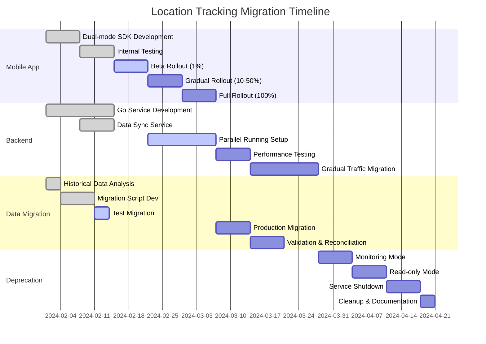

# Location Tracking Migration Strategy
## From TypeScript/MQTT to Go/Pub/Sub

## Table of Contents
1. [Executive Summary](#1-executive-summary)
2. [Migration Overview](#2-migration-overview)
3. [Phase 1: Mobile App Migration](#3-phase-1-mobile-app-migration)
4. [Phase 2: Backend Migration](#4-phase-2-backend-migration)
5. [Phase 3: Deprecation](#5-phase-3-deprecation)
6. [Risk Mitigation](#6-risk-mitigation)
7. [Rollback Procedures](#7-rollback-procedures)
8. [Timeline](#8-timeline)

## 1. Executive Summary

### Migration Goals
- **Zero Downtime**: Seamless transition without service interruption
- **Data Integrity**: No location data loss during migration
- **Gradual Rollout**: Phased approach with validation at each step
- **Reversibility**: Ability to rollback at any stage

### Key Principles
1. **Dual Publishing**: Apps publish to both MQTT and Pub/Sub
2. **Parallel Running**: Both systems run simultaneously
3. **Feature Parity**: New system matches all existing features
4. **Incremental Migration**: Device-by-device, company-by-company

## 2. Migration Overview

### Current State (TypeScript + MQTT)
```
Mobile App → MQTT Client → EMQX Broker → Node.js Service → MongoDB
```

### Target State (Go + Pub/Sub)
```
Mobile App → Pub/Sub SDK → Google Pub/Sub → Go Service → ClickHouse
```

### Transition State (Dual Mode)
```
Mobile App ─┬→ MQTT Client → EMQX → Node.js → MongoDB
            └→ Pub/Sub SDK → Pub/Sub → Go → ClickHouse
```

## 3. Phase 1: Mobile App Migration (Weeks 1-4)

### 3.1 Mobile SDK Changes

#### Current MQTT Implementation
```typescript
// Current implementation
class LocationTracker {
  private mqttClient: MQTTClient;
  
  async sendLocation(location: Location) {
    const topic = `device/telemetry/${this.deviceId}`;
    await this.mqttClient.publish(topic, JSON.stringify(location));
  }
}
```

#### New Dual-Mode Implementation
```typescript
// Transition implementation with feature flag
class LocationTracker {
  private mqttClient: MQTTClient;
  private pubsubClient: PubSubClient;
  private config: MigrationConfig;
  
  async sendLocation(location: Location) {
    const promises: Promise<void>[] = [];
    
    // Always send to MQTT (existing system)
    if (this.config.mqttEnabled) {
      promises.push(this.sendViaMQTT(location));
    }
    
    // Conditionally send to Pub/Sub (new system)
    if (this.config.pubsubEnabled) {
      promises.push(this.sendViaPubSub(location));
    }
    
    // Wait for at least one to succeed
    await Promise.race(promises);
  }
  
  private async sendViaMQTT(location: Location) {
    const topic = `device/telemetry/${this.deviceId}`;
    await this.mqttClient.publish(topic, JSON.stringify(location));
  }
  
  private async sendViaPubSub(location: Location) {
    const message = {
      data: Buffer.from(JSON.stringify(location)),
      attributes: {
        deviceId: this.deviceId,
        timestamp: location.timestamp.toString(),
        priority: 'normal'
      }
    };
    await this.pubsubClient.topic('location-updates').publish(message);
  }
}
```

#### Configuration Management
```typescript
interface MigrationConfig {
  mqttEnabled: boolean;
  pubsubEnabled: boolean;
  pubsubPercentage: number; // For gradual rollout
  fallbackToMqtt: boolean;
  debugMode: boolean;
}

// Remote configuration service
class RemoteConfig {
  async getMigrationConfig(deviceId: string): Promise<MigrationConfig> {
    // Fetch from Firebase Remote Config or similar
    const config = await firebase.remoteConfig().fetch();
    
    // Device-specific override
    const override = config.getValue(`migration_override_${deviceId}`);
    if (override.asString()) {
      return JSON.parse(override.asString());
    }
    
    // Percentage-based rollout
    const percentage = config.getValue('pubsub_rollout_percentage').asNumber();
    const deviceHash = hashCode(deviceId);
    const isPubSubEnabled = (deviceHash % 100) < percentage;
    
    return {
      mqttEnabled: true, // Always true during migration
      pubsubEnabled: isPubSubEnabled,
      pubsubPercentage: percentage,
      fallbackToMqtt: true,
      debugMode: config.getValue('debug_mode').asBoolean()
    };
  }
}
```

### 3.2 iOS Implementation

```swift
// iOS LocationManager with dual publishing
class LocationManager {
    private let mqttClient: MQTTClient
    private let pubsubClient: PubSubClient
    private let config: MigrationConfig
    
    func sendLocation(_ location: CLLocation) {
        let locationData = LocationData(
            latitude: location.coordinate.latitude,
            longitude: location.coordinate.longitude,
            speed: location.speed,
            accuracy: location.horizontalAccuracy,
            timestamp: location.timestamp
        )
        
        // Dual publishing with error handling
        let dispatchGroup = DispatchGroup()
        var mqttSuccess = false
        var pubsubSuccess = false
        
        if config.mqttEnabled {
            dispatchGroup.enter()
            mqttClient.publish(topic: "device/telemetry/\(deviceId)", 
                             data: locationData) { error in
                mqttSuccess = (error == nil)
                dispatchGroup.leave()
            }
        }
        
        if config.pubsubEnabled {
            dispatchGroup.enter()
            pubsubClient.publish(message: locationData) { error in
                pubsubSuccess = (error == nil)
                dispatchGroup.leave()
            }
        }
        
        dispatchGroup.notify(queue: .main) {
            self.logMigrationMetrics(mqttSuccess: mqttSuccess, 
                                   pubsubSuccess: pubsubSuccess)
        }
    }
}
```

### 3.3 Android Implementation

```kotlin
// Android LocationService with dual publishing
class LocationService : Service() {
    private lateinit var mqttClient: MqttClient
    private lateinit var pubsubClient: PubSubClient
    private lateinit var config: MigrationConfig
    
    fun sendLocation(location: Location) {
        val locationData = LocationData(
            latitude = location.latitude,
            longitude = location.longitude,
            speed = location.speed,
            accuracy = location.accuracy,
            timestamp = System.currentTimeMillis()
        )
        
        // Coroutine for parallel publishing
        GlobalScope.launch {
            val jobs = mutableListOf<Deferred<Boolean>>()
            
            if (config.mqttEnabled) {
                jobs.add(async { 
                    try {
                        mqttClient.publish(
                            "device/telemetry/$deviceId",
                            locationData.toJson()
                        )
                        true
                    } catch (e: Exception) {
                        Log.e(TAG, "MQTT publish failed", e)
                        false
                    }
                })
            }
            
            if (config.pubsubEnabled) {
                jobs.add(async {
                    try {
                        pubsubClient.publish(
                            PubsubMessage.newBuilder()
                                .setData(locationData.toByteString())
                                .putAttributes("deviceId", deviceId)
                                .build()
                        )
                        true
                    } catch (e: Exception) {
                        Log.e(TAG, "PubSub publish failed", e)
                        false
                    }
                })
            }
            
            val results = jobs.awaitAll()
            logMigrationMetrics(results)
        }
    }
}
```

### 3.4 Rollout Strategy

#### Week 1: Internal Testing
- Deploy dual-mode to internal test devices
- Monitor both pipelines
- Validate data consistency

#### Week 2: Beta Users (1%)
- Enable for 1% of users
- Monitor performance metrics
- A/B test latency and reliability

#### Week 3: Gradual Rollout (10% → 50%)
- Increase percentage daily
- Monitor error rates
- Track battery impact

#### Week 4: Full Rollout (100%)
- Enable for all users
- Keep MQTT as fallback
- Prepare for backend migration

## 4. Phase 2: Backend Migration (Weeks 5-12)

### 4.1 Parallel System Architecture

```yaml
# Docker Compose for parallel running
version: '3.8'

services:
  # Existing TypeScript system
  nodejs-api:
    image: innovd/location-api:current
    environment:
      - MQTT_BROKER=emqx:1883
      - MONGODB_URI=mongodb://mongo:27017
    ports:
      - "3000:3000"
  
  # New Go system
  go-ingestion:
    image: innovd/location-ingestion:v1.0.0
    environment:
      - PUBSUB_PROJECT=innovd-prod
      - CLICKHOUSE_DSN=clickhouse://clickhouse:9000
    ports:
      - "8080:8080"
  
  # Data sync service
  data-sync:
    image: innovd/location-sync:v1.0.0
    environment:
      - SOURCE_MONGODB=mongodb://mongo:27017
      - TARGET_CLICKHOUSE=clickhouse://clickhouse:9000
      - SYNC_MODE=real-time
```

### 4.2 Data Synchronization

#### Real-time Sync Service
```go
// Sync service to keep both databases in sync during migration
package main

type DataSyncService struct {
    mongoClient     *mongo.Client
    clickhouseConn  *clickhouse.Conn
    lastSyncTime    time.Time
}

func (s *DataSyncService) StartSync(ctx context.Context) error {
    // Watch MongoDB changes
    pipeline := mongo.Pipeline{
        {{"$match", bson.D{
            {"operationType", bson.D{{"$in", bson.A{"insert", "update"}}}},
            {"fullDocument.timestamp", bson.D{{"$gte", s.lastSyncTime}}},
        }}},
    }
    
    changeStream, err := s.mongoClient.
        Database("innovd").
        Collection("deviceTelemetry").
        Watch(ctx, pipeline)
    
    if err != nil {
        return err
    }
    defer changeStream.Close(ctx)
    
    // Process changes
    for changeStream.Next(ctx) {
        var event ChangeEvent
        if err := changeStream.Decode(&event); err != nil {
            log.Error("Failed to decode change event", err)
            continue
        }
        
        // Transform and insert into ClickHouse
        if err := s.syncToClickHouse(ctx, event.FullDocument); err != nil {
            log.Error("Failed to sync to ClickHouse", err)
            // Implement retry logic
        }
    }
    
    return nil
}
```

#### Batch Migration for Historical Data
```go
func (s *DataSyncService) MigrateHistoricalData(ctx context.Context, startDate, endDate time.Time) error {
    const batchSize = 10000
    
    // Count total documents
    filter := bson.M{
        "timestamp": bson.M{
            "$gte": startDate,
            "$lte": endDate,
        },
    }
    
    total, err := s.mongoClient.
        Database("innovd").
        Collection("deviceTelemetry").
        CountDocuments(ctx, filter)
    
    if err != nil {
        return err
    }
    
    log.Info("Starting migration", "total_documents", total)
    
    // Process in batches
    for offset := int64(0); offset < total; offset += batchSize {
        cursor, err := s.mongoClient.
            Database("innovd").
            Collection("deviceTelemetry").
            Find(ctx, filter, options.Find().
                SetSkip(offset).
                SetLimit(batchSize).
                SetSort(bson.D{{"timestamp", 1}}))
        
        if err != nil {
            return err
        }
        
        var batch []DeviceTelemetry
        if err := cursor.All(ctx, &batch); err != nil {
            cursor.Close(ctx)
            return err
        }
        cursor.Close(ctx)
        
        // Bulk insert into ClickHouse
        if err := s.bulkInsertClickHouse(ctx, batch); err != nil {
            return err
        }
        
        log.Info("Migrated batch", "offset", offset, "size", len(batch))
    }
    
    return nil
}
```

### 4.3 API Compatibility Layer

#### Backward Compatible API Gateway
```go
// API Gateway that routes to appropriate backend
package gateway

type APIGateway struct {
    typescriptClient *http.Client
    goClient         *grpc.ClientConn
    migrationConfig  *MigrationConfig
}

func (g *APIGateway) HandleLocationUpdate(w http.ResponseWriter, r *http.Request) {
    // Parse request
    var req LocationUpdateRequest
    if err := json.NewDecoder(r.Body).Decode(&req); err != nil {
        http.Error(w, err.Error(), http.StatusBadRequest)
        return
    }
    
    // Determine routing based on device
    useNewSystem := g.shouldUseNewSystem(req.DeviceID)
    
    if useNewSystem {
        // Route to Go service
        resp, err := g.forwardToGoService(r.Context(), &req)
        if err != nil {
            // Fallback to TypeScript service
            log.Warn("Go service failed, falling back", "error", err)
            resp, err = g.forwardToTypeScriptService(r.Context(), &req)
        }
    } else {
        // Route to TypeScript service
        resp, err := g.forwardToTypeScriptService(r.Context(), &req)
    }
    
    // Return response
    json.NewEncoder(w).Encode(resp)
}

func (g *APIGateway) shouldUseNewSystem(deviceID string) bool {
    // Check migration configuration
    config := g.migrationConfig.GetDeviceConfig(deviceID)
    
    // Gradual rollout logic
    if config.ForceNewSystem {
        return true
    }
    
    if config.ForceOldSystem {
        return false
    }
    
    // Percentage-based routing
    hash := crc32.ChecksumIEEE([]byte(deviceID))
    return (hash % 100) < config.NewSystemPercentage
}
```

### 4.4 Feature Parity Checklist

| Feature | TypeScript | Go | Status | Notes |
|---------|------------|-----|--------|--------|
| Location Update | ✅ | ✅ | Done | |
| Batch Update | ✅ | ✅ | Done | |
| Stoppage Detection | ✅ | ✅ | Done | |
| GPS Drift Filter | ✅ | ✅ | Done | |
| Geofencing | ✅ | ✅ | Done | |
| Route History | ✅ | ✅ | Done | |
| Analytics API | ✅ | ✅ | Done | |
| WebSocket Updates | ✅ | ✅ | Done | |
| Retailer Association | ✅ | ✅ | Done | |
| Battery Monitoring | ✅ | ✅ | Done | |
| Activity Logging | ✅ | ✅ | Done | |
| Data Export | ✅ | ⏳ | In Progress | |
| Custom Reports | ✅ | ⏳ | In Progress | |

### 4.5 Data Validation

#### Continuous Validation Service
```go
// Service that continuously validates data consistency
type ValidationService struct {
    mongoRepo      *MongoRepository
    clickhouseRepo *ClickHouseRepository
    alerting       *AlertingService
}

func (v *ValidationService) ValidateDataConsistency(ctx context.Context) {
    ticker := time.NewTicker(5 * time.Minute)
    defer ticker.Stop()
    
    for {
        select {
        case <-ticker.C:
            if err := v.runValidation(ctx); err != nil {
                v.alerting.SendAlert("Data validation failed", err)
            }
        case <-ctx.Done():
            return
        }
    }
}

func (v *ValidationService) runValidation(ctx context.Context) error {
    // Compare record counts
    mongoCount, err := v.mongoRepo.CountRecords(ctx, time.Now().Add(-1*time.Hour))
    if err != nil {
        return err
    }
    
    clickhouseCount, err := v.clickhouseRepo.CountRecords(ctx, time.Now().Add(-1*time.Hour))
    if err != nil {
        return err
    }
    
    if math.Abs(float64(mongoCount-clickhouseCount)) > float64(mongoCount)*0.01 {
        return fmt.Errorf("record count mismatch: mongo=%d, clickhouse=%d", 
            mongoCount, clickhouseCount)
    }
    
    // Sample data comparison
    samples, err := v.mongoRepo.GetRandomSamples(ctx, 100)
    if err != nil {
        return err
    }
    
    for _, sample := range samples {
        chSample, err := v.clickhouseRepo.GetByID(ctx, sample.ID)
        if err != nil {
            return err
        }
        
        if !v.compareRecords(sample, chSample) {
            return fmt.Errorf("data mismatch for ID: %s", sample.ID)
        }
    }
    
    return nil
}
```

## 5. Phase 3: Deprecation (Weeks 13-16)

### 5.1 TypeScript Service Deprecation

#### Week 13: Monitoring Mode
```typescript
// Add deprecation warnings to TypeScript service
class LocationTrackingService {
  constructor() {
    logger.warn('⚠️ This service is deprecated and will be removed on [DATE]');
    logger.warn('⚠️ All traffic should be migrated to the Go service');
    
    // Monitor remaining traffic
    this.startDeprecationMonitoring();
  }
  
  private startDeprecationMonitoring() {
    setInterval(() => {
      const metrics = {
        requestsPerMinute: this.getRequestRate(),
        uniqueDevices: this.getUniqueDeviceCount(),
        timestamp: new Date()
      };
      
      // Log to monitoring system
      logger.info('Deprecation metrics', metrics);
      
      // Alert if traffic increases
      if (metrics.requestsPerMinute > 100) {
        this.alerting.send('Unexpected traffic on deprecated service', metrics);
      }
    }, 60000); // Every minute
  }
}
```

#### Week 14: Read-Only Mode
```typescript
// Convert to read-only mode
class LocationTrackingService {
  async processLocationUpdate(data: LocationUpdate): Promise<void> {
    // Log attempt
    logger.warn('Attempted write to deprecated service', {
      deviceId: data.deviceId,
      timestamp: new Date()
    });
    
    // Return error
    throw new Error('This service is in read-only mode. Please use the new API.');
  }
  
  async getLocationHistory(userId: string, date: string): Promise<Location[]> {
    // Still allow reads during transition
    logger.info('Read request to deprecated service', { userId, date });
    return this.repository.getLocationHistory(userId, date);
  }
}
```

#### Week 15-16: Complete Shutdown
```yaml
# Kubernetes deployment scaling down
apiVersion: apps/v1
kind: Deployment
metadata:
  name: location-tracking-typescript
spec:
  replicas: 0  # Scale to zero
  
---
# Add service redirect
apiVersion: networking.k8s.io/v1
kind: Ingress
metadata:
  name: location-tracking-redirect
  annotations:
    nginx.ingress.kubernetes.io/permanent-redirect: "https://api.innovd.com/v2/locations"
spec:
  rules:
  - host: api.innovd.com
    http:
      paths:
      - path: /v1/locations
        pathType: Prefix
        backend:
          service:
            name: redirect-service
            port:
              number: 80
```

### 5.2 MQTT Broker Deprecation

#### Graceful MQTT Shutdown
```javascript
// MQTT deprecation handler
class MQTTDeprecationHandler {
  async startGracefulShutdown() {
    // Step 1: Reject new connections
    this.broker.on('client.connect', (client) => {
      client.close('MQTT service is deprecated. Please upgrade your app.');
    });
    
    // Step 2: Notify existing clients
    const connectedClients = await this.broker.getClients();
    for (const client of connectedClients) {
      await client.publish('system/deprecation', {
        message: 'MQTT will be discontinued on [DATE]. Please upgrade.',
        upgradeUrl: 'https://docs.innovd.com/migration'
      });
    }
    
    // Step 3: Gradual disconnection
    const shutdownDate = new Date('2024-04-01');
    const daysUntilShutdown = Math.ceil((shutdownDate - new Date()) / (1000 * 60 * 60 * 24));
    
    if (daysUntilShutdown <= 7) {
      // Disconnect 20% of clients each day
      const percentageToDisconnect = Math.min(100, (7 - daysUntilShutdown + 1) * 20);
      await this.disconnectPercentageOfClients(percentageToDisconnect);
    }
  }
}
```

### 5.3 Database Migration Completion

#### MongoDB to ClickHouse Final Sync
```go
func (m *MigrationService) CompleteMigration(ctx context.Context) error {
    // Step 1: Final consistency check
    if err := m.validateFullDataset(ctx); err != nil {
        return fmt.Errorf("data validation failed: %w", err)
    }
    
    // Step 2: Capture final MongoDB state
    finalSnapshot, err := m.createMongoSnapshot(ctx)
    if err != nil {
        return fmt.Errorf("snapshot creation failed: %w", err)
    }
    
    // Step 3: Apply any remaining changes
    if err := m.syncFinalChanges(ctx, finalSnapshot); err != nil {
        return fmt.Errorf("final sync failed: %w", err)
    }
    
    // Step 4: Switch primary database flag
    if err := m.updateConfiguration(ctx, map[string]string{
        "primary_database": "clickhouse",
        "mongodb_status": "archived",
        "migration_completed": time.Now().Format(time.RFC3339),
    }); err != nil {
        return fmt.Errorf("configuration update failed: %w", err)
    }
    
    // Step 5: Create backup
    if err := m.createArchivalBackup(ctx); err != nil {
        return fmt.Errorf("backup creation failed: %w", err)
    }
    
    log.Info("Migration completed successfully", 
        "total_records_migrated", finalSnapshot.TotalRecords,
        "duration", time.Since(m.startTime))
    
    return nil
}
```

## 6. Risk Mitigation

### 6.1 Identified Risks and Mitigations

| Risk | Impact | Probability | Mitigation |
|------|--------|-------------|------------|
| Data Loss | High | Low | Dual publishing, continuous validation |
| Service Downtime | High | Low | Parallel running, gradual rollout |
| Performance Degradation | Medium | Medium | Load testing, monitoring |
| Battery Drain (Mobile) | Medium | Medium | Optimize SDK, monitor battery stats |
| Cost Overrun | Low | Medium | Budget alerts, resource optimization |
| Team Knowledge Gap | Medium | High | Training, documentation, pair programming |

### 6.2 Monitoring & Alerting

```yaml
# Prometheus alerts for migration monitoring
groups:
  - name: migration_alerts
    rules:
      - alert: DataInconsistency
        expr: |
          abs(mongodb_location_count - clickhouse_location_count) 
          / mongodb_location_count > 0.01
        for: 5m
        annotations:
          summary: "Data inconsistency detected between MongoDB and ClickHouse"
          
      - alert: MigrationLatency
        expr: |
          histogram_quantile(0.99, location_sync_duration_seconds) > 5
        for: 10m
        annotations:
          summary: "High latency in data synchronization"
          
      - alert: PubSubErrorRate
        expr: |
          rate(pubsub_publish_errors_total[5m]) > 0.01
        annotations:
          summary: "High error rate in Pub/Sub publishing"
```

## 7. Rollback Procedures

### 7.1 Mobile App Rollback

```typescript
// Emergency rollback configuration
class EmergencyRollback {
  async execute() {
    // Step 1: Disable Pub/Sub immediately
    await this.remoteConfig.update({
      pubsubEnabled: false,
      mqttEnabled: true,
      emergencyMode: true
    });
    
    // Step 2: Force app config refresh
    await this.pushNotification.sendToAll({
      type: 'CONFIG_REFRESH_REQUIRED',
      priority: 'HIGH'
    });
    
    // Step 3: Monitor rollback
    this.monitoring.trackRollback({
      timestamp: new Date(),
      reason: 'Manual trigger',
      affectedDevices: 'all'
    });
  }
}
```

### 7.2 Backend Rollback

```bash
#!/bin/bash
# rollback-backend.sh

echo "Starting emergency rollback..."

# Step 1: Update ingress to route all traffic to TypeScript service
kubectl patch ingress location-api --type='json' -p='[
  {"op": "replace", "path": "/spec/rules/0/http/paths/0/backend/service/name", "value": "location-api-typescript"}
]'

# Step 2: Scale down Go services
kubectl scale deployment location-ingestion-go --replicas=0
kubectl scale deployment location-processor-go --replicas=0

# Step 3: Ensure TypeScript service is fully scaled
kubectl scale deployment location-api-typescript --replicas=10

# Step 4: Stop data synchronization
kubectl scale deployment data-sync-service --replicas=0

# Step 5: Update configuration
kubectl create configmap migration-status --from-literal=status=rolled_back --dry-run=client -o yaml | kubectl apply -f -

echo "Rollback completed. Please verify system status."
```

### 7.3 Database Rollback

```go
// Point-in-time recovery for ClickHouse
func (r *RecoveryService) RollbackToTimestamp(ctx context.Context, timestamp time.Time) error {
    // Step 1: Stop writes to ClickHouse
    if err := r.disableClickHouseWrites(ctx); err != nil {
        return err
    }
    
    // Step 2: Create backup of current state
    backupID, err := r.createBackup(ctx, "pre-rollback")
    if err != nil {
        return err
    }
    
    // Step 3: Restore MongoDB as primary
    if err := r.enableMongoDBWrites(ctx); err != nil {
        return err
    }
    
    // Step 4: Restore ClickHouse to timestamp
    if err := r.restoreClickHouseToTime(ctx, timestamp); err != nil {
        // Restore from backup if recovery fails
        r.restoreFromBackup(ctx, backupID)
        return err
    }
    
    return nil
}
```

## 8. Timeline

### Detailed Migration Schedule



### Key Milestones

| Date | Milestone | Success Criteria |
|------|-----------|------------------|
| Week 2 | Mobile SDK Ready | Dual publishing working on test devices |
| Week 4 | 50% Mobile Migration | Half of devices using Pub/Sub |
| Week 6 | Backend Parallel Running | Both systems processing same data |
| Week 8 | 50% Backend Migration | Half of traffic on Go service |
| Week 10 | Full Backend Migration | All traffic on Go service |
| Week 12 | Data Migration Complete | ClickHouse as primary database |
| Week 14 | TypeScript Deprecated | Old service in read-only mode |
| Week 16 | Migration Complete | MQTT broker shutdown |

### Success Metrics

1. **Zero Data Loss**: 100% data integrity
2. **Uptime**: 99.99% availability maintained
3. **Performance**: <10ms p99 latency
4. **Cost**: 40% reduction achieved
5. **User Impact**: <0.1% error rate

---

This migration strategy ensures a smooth transition from the TypeScript/MQTT system to the Go/Pub/Sub system with minimal risk and maximum flexibility for rollback if needed.